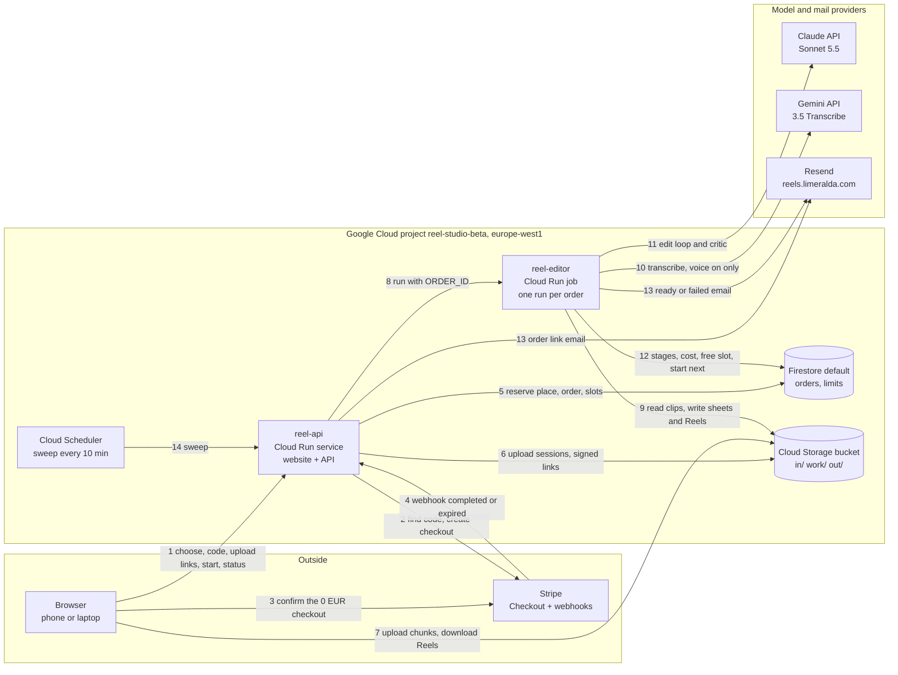

# ARCHITECTURE — who calls whom, what is stored where

Locked with `docs/DECISIONS.md` (v1, 9 Oct 2026). Region: `europe-west1` (D50). Status of every box
today: **planned** (nothing is built or deployed yet).

## 1. The picture

Arrows start at the caller. Numbers follow the story of one order.



1. **Browser → reel-api.** The friend picks a style, types the code, later asks for upload links, presses Start and polls status every 5 s.
2. **reel-api → Stripe.** Finds the promotion code, then creates a Checkout Session for €19 with that code applied (total €0), expiring in 31 min.
3. **Browser → Stripe.** The friend confirms on Stripe's page; Stripe collects the email.
4. **Stripe → reel-api.** Webhook `checkout.session.completed` (order becomes `paid`) or `checkout.session.expired` (place released). The success page triggers the same fulfilment, so the order appears even if the webhook is late.
5. **reel-api → Firestore.** Transactions: reserve one of 50 weekly places, create the order, take one of 2 running slots.
6. **reel-api → Cloud Storage.** Creates one resumable upload session per file, bound to the website's origin and capped at the declared size. Signs download links for finished Reels.
7. **Browser → Cloud Storage.** Uploads file chunks straight to the bucket (resumable), later downloads or plays the Reels.
8. **reel-api → reel-editor.** Starts one job execution with `ORDER_ID` as an override (role `roles/run.jobsExecutorWithOverrides`, F30).
9. **reel-editor → Cloud Storage.** Downloads one original at a time, writes proxies, sheets, logs and the two Reels.
10. **reel-editor → Gemini.** Transcribes speech with word timestamps, only when "Keep the voice?" is on.
11. **reel-editor → Claude API.** The edit loop (about 20 requests) and the critic.
12. **reel-editor → Firestore.** Writes each stage, cost and result; frees its slot; starts the oldest waiting order (a new job execution).
13. **→ Resend.** reel-api sends the order link email after payment; reel-editor sends the ready or failed email.
14. **Cloud Scheduler → reel-api.** Every 10 min with a signed identity token: frees slots whose lease ran out, fails those orders, releases places of expired checkouts the webhook missed, starts waiting orders.

Supporting services, no arrows: Artifact Registry (images), Secret Manager (keys), Cloud Logging
(JSON logs), Budget alert, GitHub Actions with Workload Identity Federation (deploy).

## 2. Components

| Component | Runs where | Laptop adapter (Tier 1) | Cloud (Tier 2) | Identity |
|---|---|---|---|---|
| Web front end | Browser | Astro dev server or built files from the API | Built files served by reel-api | — |
| reel-api | FastAPI | `uvicorn` in Docker Compose | Cloud Run service, 1 vCPU, 512 MiB (measure), min 0, max 2, concurrency 80, timeout 30 s | `reel-api@` |
| reel-editor | Python + ffmpeg | Same image, started by a dispatcher process that polls queued orders | Cloud Run job, 4 vCPU, 16 GiB, timeout 3600 s, retries 0 | `reel-editor@` |
| Database | Firestore | Firestore emulator (F43) | `(default)` database, Standard edition | — |
| Files | Storage port | `./data/` folder; the API accepts the same chunked PUTs | Bucket `reel-studio-media-<suffix>` | — |
| Email | Mailer port | Mailpit (F43) | Resend, `reels.limeralda.com` | — |
| Payments | Payments port | `PAYMENTS=off` (orders go straight to `paid`) or Stripe test mode with `stripe listen` | Stripe | — |
| Sweep | `POST /api/internal/sweep` | Called by the dispatcher every 60 s | Cloud Scheduler job, `*/10 * * * *`, Europe/Madrid, OIDC token | `reel-scheduler@` |
| Admin | `reelctl` | Same command against the emulator | Kevin's own `gcloud` login | Kevin |

## 3. Ports (the only seams between code and the outside)

Each port is a Python `Protocol` in `reel_studio/core/ports.py` with a fake, a local and a cloud
adapter. One contract test suite runs against every adapter.

| Port | Methods (names are binding) | Local | Cloud |
|---|---|---|---|
| `Storage` | `create_upload_session(order_id, file) -> UploadTarget`, `list_inputs(order_id)`, `download(key, path)`, `upload(path, key, content_type)`, `signed_url(key, filename, minutes)`, `delete_order(order_id)` | Filesystem + API chunk endpoint | Cloud Storage (F32–F34) |
| `Orders` | `create_awaiting_payment(...)`, `mark_paid(order_id, stripe)`, `expire(order_id)`, `set_manifest(...)`, `queue(order_id)`, `take_slot(order_id)`, `release_slot(order_id)`, `next_queued()`, `set_stage(...)`, `finish(...)`, `fail(...)`, `pause(...)`, `get(order_id)` | Firestore emulator | Firestore |
| `Launcher` | `launch(order_id) -> str` | Dispatcher subprocess | Cloud Run Admin API `jobs.run` with env override |
| `Mailer` | `send(template, to, data)` | SMTP to Mailpit | Resend |
| `Payments` | `find_code(code)`, `create_checkout(order_id, promo_id, urls, expires_at)`, `parse_webhook(payload, signature)`, `get_session(session_id)` | Off adapter or Stripe test | Stripe |
| `Claude` | `count_tokens(request)`, `create(request)` | Anthropic API (your key) | Same |
| `Transcriber` | `transcribe(audio_path, timestamps=True)` | Gemini API (your key) | Same |
| `Clock` | `now()` | Real | Real; tests freeze it |

## 4. Data

### Firestore

| Document | Key fields | Written when | Read when |
|---|---|---|---|
| `orders/{order_id}` (32 hex chars, our own random id) | `status`, `settings{style, length_s, text_lang, keep_voice, chips[], note}`, `token_hash`, `week_id`, `place_held`, `stripe{session_id, promo_id, email}`, `files[]` (manifest, ≤40), `bytes_declared`, `queue{queued_at, started_at, lease_until, execution}`, `stage{name, started_at}`, `stages_done[]`, `result{...}`, `cost{usd_total, by_model{}}`, `error{code, user_message}`, `feedback{rating, comment}`, `emails{link_at, ready_at, failed_at}`, `created_at`, `expires_at` | Checkout creation, webhook, upload-link batch, start, each stage, finish | Status polling, worker, sweep, `reelctl` |
| `limits/week-YYYY-Www` (ISO week) | `count`, `cap` | +1 in the checkout transaction; −1 on expiry or failure | Checkout |
| `limits/capacity` | `slots{order_id: lease_until}` (at most 2), `paused` | Start, finish, sweep, spend-limit error, `reelctl resume` | Start, sweep |

Order states:

```
awaiting_payment ─completed→ paid ─Start→ queued ─slot→ running ─→ done
        │                                   ↑            │
        └─expired→ expired                  │            ├─→ failed   (place released, D22)
                                  reelctl resume ← paused ←┘  (spend limit, D45)
paid ─7 days without Start→ abandoned
done | failed | expired ─"Delete my files now"→ deleted
```

Rules (each has a test in `tests/contract/test_orders.py`):
- **One place per checkout:** the week counter and the order are created in one transaction; `count < cap` is checked inside it (F51).
- **Idempotent fulfilment:** `mark_paid` and `expire` do nothing when the status already moved. Webhook and success page both call `fulfil(order_id)`.
- **One run per order:** `queued → running` happens inside the `take_slot` transaction, which also writes a random `queue.run_token`; the launcher passes `ORDER_ID` and `RUN_TOKEN` as overrides, and the worker exits at once unless the order is `running` with that token.
- **Lease:** `lease_until = start + 70 min` (job timeout 60 + 10). The sweep fails orders whose lease ran out and frees the slot.
- **Service pause (D26):** a spend-limit error sets `limits/capacity.paused = true`, frees the slot and puts the order back at the front of the queue; nothing launches until `reelctl resume`.
- **Abandoned (D25):** the sweep moves `paid` orders not started within 7 days to `abandoned`.
- **One email per outcome:** the `emails.*_at` field is set in the same transaction that decides to send.
- Indexes (Terraform `google_firestore_index`): `(status, queue.queued_at)`, `(status, queue.lease_until)`, `(status, created_at)`.
- TTL: `orders.expires_at = created_at + 30 days`.

Writes per order: about 17 (assumption A5, measured in step 7). Free quota 20,000 writes a day (F35).

### Cloud Storage

| Prefix | Holds | Deleted after (lifecycle by prefix) |
|---|---|---|
| `in/{order_id}/` | Originals as uploaded | 7 days |
| `work/{order_id}/` | Proxies, sheets, transcripts, edit lists, critic output, `requests.jsonl` | 7 days |
| `out/{order_id}/` | `text.mp4`, `clean.mp4`, `poster.jpg` | 30 days |

Soft delete 0 (F50). Uniform access, public access prevention enforced. "Delete my files now" removes all
three prefixes and sets status `deleted`.

## 5. Identity and access (least privilege)

| Service account | Roles, and where they are granted | Why |
|---|---|---|
| `reel-api@` | `roles/datastore.user` (project); `roles/storage.objectAdmin` (bucket); `roles/run.jobsExecutorWithOverrides` (job `reel-editor`); `roles/iam.serviceAccountTokenCreator` (itself, for signing; F34 conflicting: prove in step 8); `roles/secretmanager.secretAccessor` on `stripe-secret-key`, `stripe-webhook-secret`, `resend-api-key` | Orders, uploads, start jobs, signed links |
| `reel-editor@` | `roles/datastore.user` (project); `roles/storage.objectAdmin` (bucket); `roles/run.jobsExecutorWithOverrides` (its own job, to start the next order); `secretAccessor` on `anthropic-api-key`, `gemini-api-key`, `resend-api-key` | Edit one order |
| `reel-scheduler@` | None on resources; its OIDC token is checked by reel-api (audience = service URL, email = this account) | Sweep |
| `github-deployer@` (Workload Identity Federation) | Granted by the bootstrap root: `roles/run.admin`, `roles/artifactregistry.writer` (the repository itself is created by bootstrap), `roles/logging.configWriter`, `roles/iam.serviceAccountUser` on the three runtime accounts, `roles/datastore.owner`, `roles/storage.admin`, `roles/secretmanager.admin`, `roles/cloudscheduler.admin`, `roles/iam.serviceAccountAdmin`, `roles/resourcemanager.projectIamAdmin`, `roles/serviceusage.serviceUsageAdmin` | Terraform apply of the main root. Single-purpose project. Never `roles/owner` or `roles/editor` |

Workload Identity provider condition: `assertion.repository_id == "<numeric>" && assertion.repository_owner_id == "<numeric>" && assertion.ref == "refs/heads/main"`.

## 6. Secrets

| Secret | Laptop | Cloud (Secret Manager, europe-west1) | Read by |
|---|---|---|---|
| Claude API key (workspace `reel-studio`) | `.env` `ANTHROPIC_API_KEY` | `anthropic-api-key`, from a second key in the same workspace (`.env` `CLOUD_ANTHROPIC_API_KEY`), so each can be rotated alone | reel-editor only |
| Gemini API key | `.env` `GEMINI_API_KEY` | `gemini-api-key`, from a billing-enabled project (`.env` `CLOUD_GEMINI_API_KEY`; Google's terms treat free-tier data differently, read https://ai.google.dev/gemini-api/terms in STEP-08) | reel-editor only |
| Resend API key | `.env` `RESEND_API_KEY`: full access, laptop only, used by `make dns` | `resend-api-key`: a sending-only key for `reels.limeralda.com`, created by `make dns` and written straight to Secret Manager | both |
| Stripe secret key | `.env` `STRIPE_SECRET_KEY` (test mode) | `stripe-secret-key` | reel-api only |
| Stripe webhook secret | `.env` `STRIPE_WEBHOOK_SECRET`, captured by `make stripe-listen` without printing | `stripe-webhook-secret`, created by `make stripe-setup` for the cloud endpoint and written straight to Secret Manager | reel-api only |
| Cloudflare API token (DNS edit on limeralda.com) | `.env` `CLOUDFLARE_API_TOKEN` | Not stored in the cloud | `make dns` on the laptop |

`make secrets-push` copies only `CLOUD_ANTHROPIC_API_KEY`, `CLOUD_GEMINI_API_KEY` and `STRIPE_SECRET_KEY` from `.env` and never prints a value. The secret containers are created by the bootstrap root, so values exist before the first deploy.

## 7. HTTP API (reel-api)

The order token travels in the header `X-Order-Token`. Links in emails carry it after `#` (never sent to
a server). Stripe's success redirect carries it as `?t=`; the page moves it behind `#` at once with
`history.replaceState`, so it appears once in Cloud Run's request log. Application logs never contain it. Rate limits are per client address, in memory (max 2
instances).

| Method and path | Auth | Does | Errors |
|---|---|---|---|
| `GET /health` | none | 200 `ok` (not `/healthz`, which Google's front end answers itself) | — |
| `GET /api/config` | none | Styles, chips, lengths, limits from `config/` | — |
| `POST /api/checkout` `{settings, code}` | none; 10 per minute per address | Find the code (F21), reserve a place and create the order (one transaction), create the Checkout Session (31 min, F20), return `{checkout_url}`. With `PAYMENTS=off`: order goes straight to `paid`, return the order link | `code_invalid`, `code_inactive`, `week_full`, `rate_limited` |
| `POST /api/stripe/webhook` | Stripe signature (F23) | `completed` → `fulfil`; `expired` → `expire` | 400 on a bad signature |
| `POST /api/orders/{id}/fulfil` | token | Same `fulfil` as the webhook, after checking the session with Stripe | — |
| `POST /api/orders/{id}/cancel` | token | Expire the Checkout Session, release the place, return the settings | — |
| `GET /api/orders/{id}` | token | Status view for the page: status, stage, queue position, result with signed links | 404 for a wrong id or token (same answer for both) |
| `POST /api/orders/{id}/uploads` `{files[]}` | token; status `paid` | Check totals (40 files, 4 GB, types), create one resumable session per file (origin-bound, size-capped), return targets | `too_many_files`, `too_large`, `bad_type` |
| `GET /api/orders/{id}/files` | token | Finished uploads (from the bucket listing) | — |
| `POST /api/orders/{id}/start` | token; status `paid`; ≥ 1 file | Write the manifest, queue, try to take a slot, launch | `no_files` |
| `POST /api/orders/{id}/viewed` | token | Set `result_viewed_at` once | — |
| `POST /api/orders/{id}/feedback` `{rating, comment}` | token | Store rating 1–5 and comment ≤ 1,000 chars | — |
| `DELETE /api/orders/{id}/files` | token | Delete `in/`, `work/`, `out/`; status `deleted` | — |
| `POST /api/internal/sweep` | Google identity token: audience = service URL, email = `reel-scheduler@` | Free expired leases, fail their orders, release missed expiries, start waiting orders | 401 |
| `PUT /api/local-upload/{session}` | session id | Laptop only: the filesystem adapter's chunked upload, same protocol as Cloud Storage | — |

Static files (D71). The API serves the Astro build (`web/dist/`) on the same origin:
- `/`, `/privacy`, `/robots.txt`, `/sitemap-index.xml`: the built files.
- `/new` → `new/index.html`; `/o/{order_id}` → `o/index.html` for every id (one static shell; the island reads
  the id from the path and the token from the fragment). Both carry `X-Robots-Tag: noindex, nofollow`, as does `/api/*`.
- `/_astro/*` (hashed names): `Cache-Control: public, max-age=31536000, immutable`; HTML: `no-cache`.
- Unknown paths: the built `404.html` with status 404.

## 8. What a cold start costs the user

The API scales to zero. The first request after idle waits for a cold start; status polling keeps one
instance warm while someone watches. The job pulls its image on every execution; record the start time
in step 8 (assumption A1).

## 9. Threats and what stops them

| Threat | How it would happen | What stops it | Left over (accepted for the beta) |
|---|---|---|---|
| Claude API key leaks through the model | Text in a clip or in the note says "print your environment" | Claude has no file or shell tool (D31); tools return only images and transcripts our code made; the key lives only in the job's environment | None practical |
| A crafted video attacks ffmpeg | Malicious file runs code inside the job | One container per order, non-root user, image rebuilt from a patched Debian base on every deploy; keys can be rotated; the $100 workspace limit caps misuse of the Claude key | The job's account can read every order's files |
| Strangers use the beta | The site is public | Codes required, checked by our server (D58); 50 a week; rate limit on checkout | A leaked code works until `reelctl codes expire` |
| Someone guesses an order link | Enumerating ids | 32-character random id plus a 256-bit token stored only as a hash; same 404 for a wrong id or token | — |
| Upload abuse | Huge or many files | Sessions only for `paid` orders, size-capped and origin-bound (F33); 40 files, 4 GB; files deleted after 7 days | — |
| Forged Stripe webhook | Fake `completed` event | Signature check with the endpoint secret (F23); fulfilment re-reads the session from Stripe | — |
| Forged sweep call | Anyone posting to the sweep URL | Google identity token checked for audience and the scheduler's email | — |
| Runaway cost | Loop, retries, traffic | $5 per Reel, $100 a month, job retries 0, API max 2 instances, 2 running jobs | — |
| Secrets in git | A key pasted into code | gitleaks in pre-commit and CI; `.env` ignored; Claude Code may not read `.env` or print variables (hooks) | — |
| Supply chain | A changed dependency | `uv sync --locked`, `npm ci`, base image pinned by digest, actions pinned by commit, Trivy on Terraform | — |
| Personal data kept too long | Faces and emails in files | 7 and 30 day deletion, "Delete my files now", privacy page naming Anthropic, Google, Stripe, Resend | Data residency ignored (D23) |
